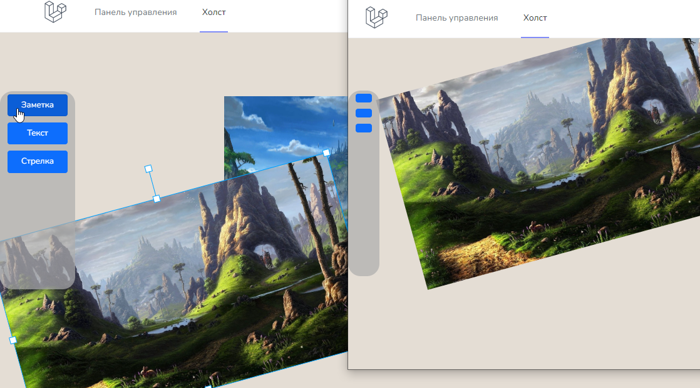

---

**[README - English version](README/EN.md)**

# Интерактивная доска
Веб-приложение для совместной работы на единой доске в реальном времени.

Для синхронизации действий между клиентами были использованы web-сокеты.

## CloudFlare

Для работы сервера сокетов рекомендуется использовать эти порты, если ваш сайт привязан к "DNS CloudFlare":

**HTTP**: 80, 8080, 8880, 2052, 2082, 2086, 2095

**HTTPS**: 443, 2053, 2083, 2087, 2096, 8443

**Пример (.env)**:

LARAVEL_WEBSOCKETS_HOST=0.0.0.0

LARAVEL_WEBSOCKETS_PORT=2053

# Демонстрация

(*Нажмите на картинку чтобы посмотреть видео*)

## Демонстрационный сайт

[Перейти на доску](https://board.vincy.ru)