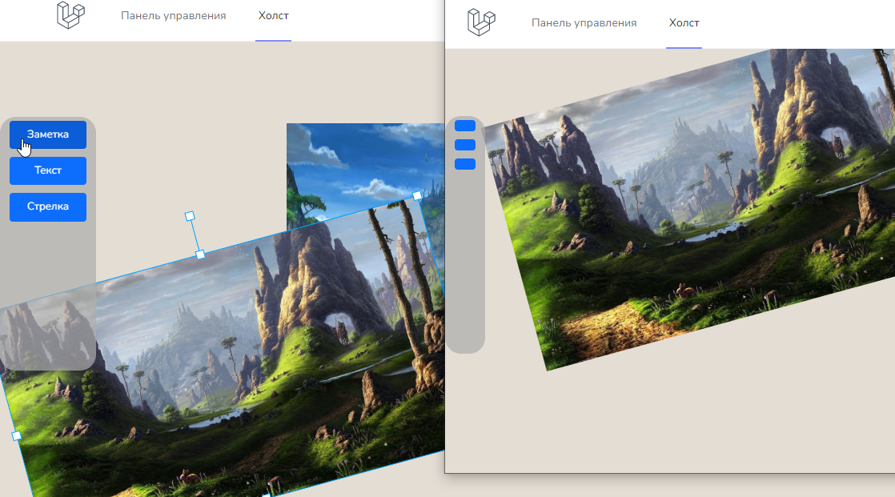

---
# Interactive board
Web application for collaboration on a single board in real time.

Web sockets were used to synchronize actions between clients.

## CloudFlare

For the socket server to work, it is recommended to use these ports if your site is bound to "DNS CloudFlare":

**HTTP**: 80, 8080, 8880, 2052, 2082, 2086, 2095

**HTTPS**: 443, 2053, 2083, 2087, 2096, 8443

**Example (.env)**:

LARAVEL_WEBSOCKETS_HOST=0.0.0.0

LARAVEL_WEBSOCKETS_PORT=2053

# Demonstration

(*Click on the picture to watch the video*)

## Demo site

[Go to board](https://board.vincy.ru)

**User test data:**

Login: guest@demo.com
Password: guestdemo